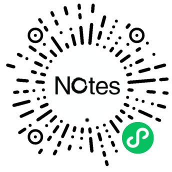

### 适用于exchange的每日回顾

- 本来想用flomo来作每日回顾，但是这需要在各个平台上下载该软件，向来讨厌在设备上安装各种杂七杂八的软件，因此就放弃了这个想法。
- 我一直在 Windows 平台使用 Sticky Notes 和在 iOS 上使用 Notes 来同步我的笔记。然而，这两个平台都没有提供回顾笔记的功能。因此，我决定使用 Exchange Web Service 来自己创建一个，以便每天回顾一些笔记。
- 该小程序功能相对简单，目前只是获取笔记，然后随机抽取15条呈现。如果要执行笔记的增删改查操作，仍然需要使用 iOS 自带的 Notes 或 Windows 自带的 Sticky Notes。
- **这个小程序不涉及第三方服务器，完全依赖 Exchange Web Service，通过小程序直接使用账号密码（或者应用密码）连接到 Exchange。因此，不涉及安全和隐私问题。**
- **该小程序目前只适用于outlook邮箱，其他邮箱可能无法使用。**
- 在用户登录之前，小程序将使用预设数据填充，因此打开后将会显示三张卡片。

### 在精力充沛的情况下，可能会做进一步的修改：
- 增加对其他邮箱的支持。
- 实现自定义标签以便更好地回顾笔记。
- 添加增删改查功能。

